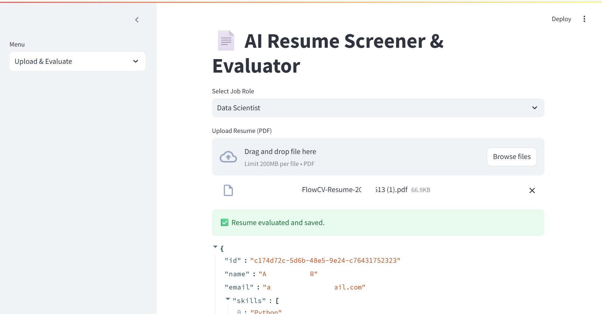
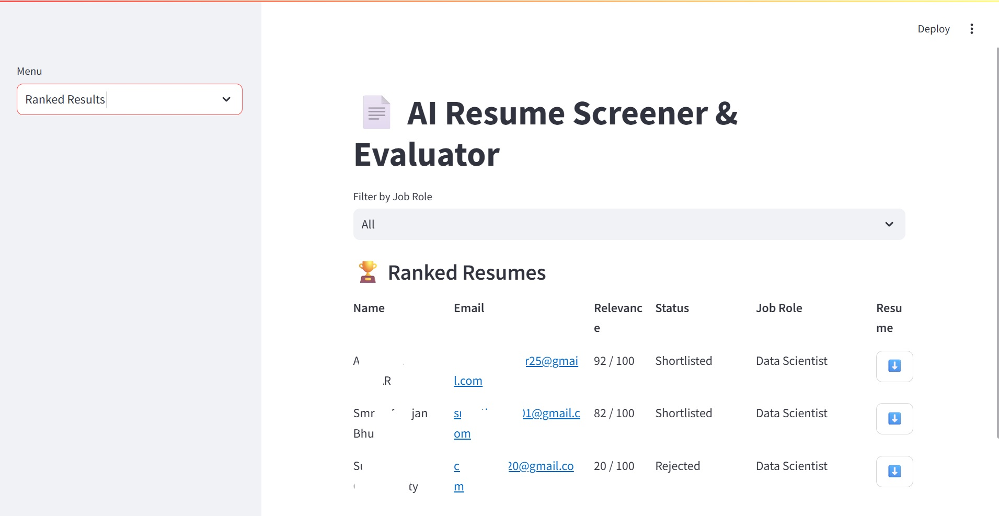

# 🧠 AI-Powered Resume Screener

A lightweight resume screening app that uses AI to extract key candidate details from PDFs and evaluates them based on skills. Built with **Streamlit**, **SQLite**, and **PyMuPDF**. Ideal for HR teams, devs, or anyone needing a smart CV filter!

---

## 📸 Screenshots


*Upload resumes and view extracted details*


*See candidate info and download PDF*

---

## 🚀 Features

- 📄 PDF Resume Upload
- 🧠 LLM-Based Evaluation (GPT or any open-source LLM)
- 🧑‍💻 Name, Email, Skills Extraction
- 🗃 Resume Storage with SQLite
- 📊 Interactive Table View

---

## 🛠️ Tech Stack

- **Frontend**: Streamlit
- **Backend**: Python, PyMuPDF, SQLite
- **AI**: OpenAI / GPT-compatible LLMs / Together.ai (pluggable)

---

🔄 Pluggable LLM Support
By default, this project uses GPT for resume evaluation.
You can use any open-source LLM model (like Mistral, LLaMA, Gemma, etc.) by simply updating the model name or API in the gpt_evaluator.py file.

---

## ⚙️ Getting Started

```bash
git clone https://github.com/your-username/ai-resume-screener.git
cd ai-resume-screener
pip install -r requirements.txt
streamlit run app.py

